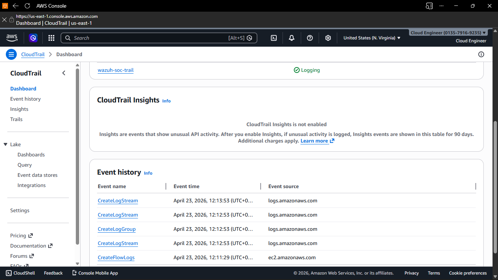
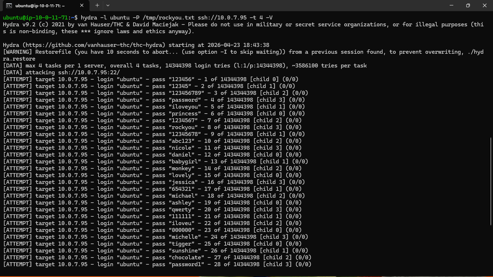
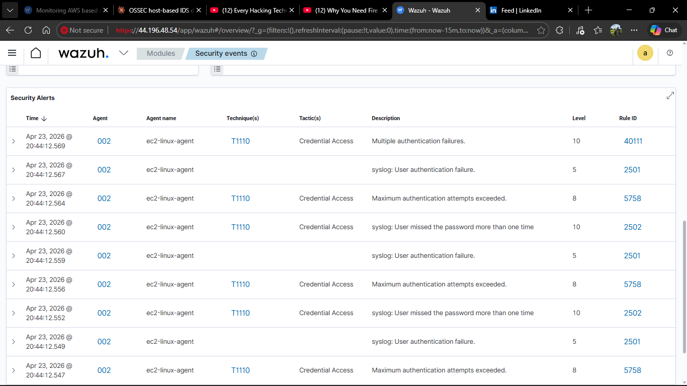
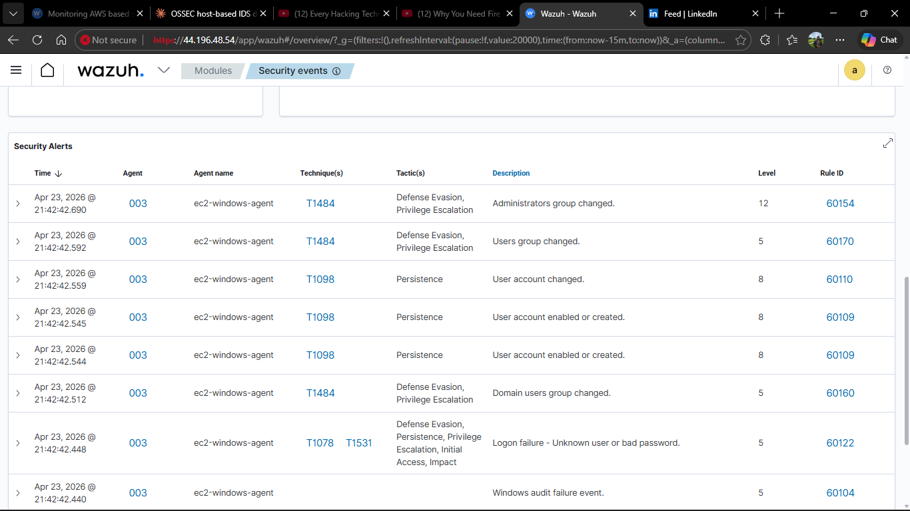
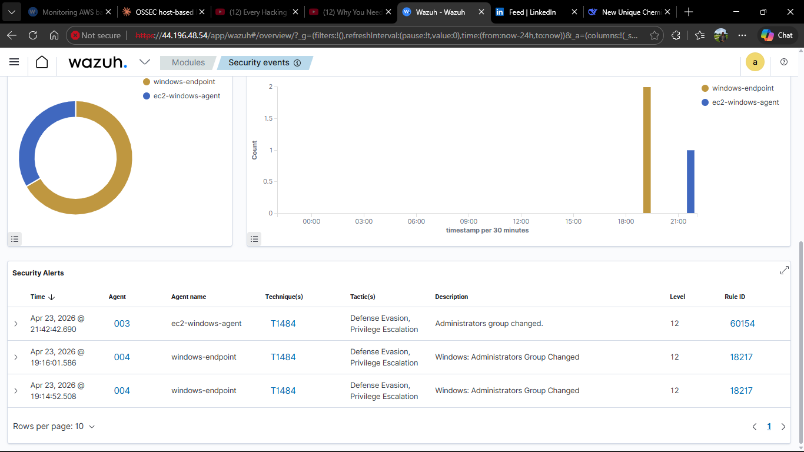
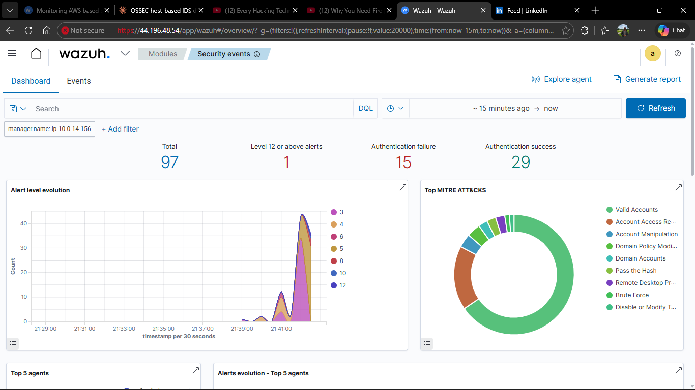

# Building a Hybrid SOC — Wazuh SIEM Monitoring AWS EC2 Workloads and On-Premise Endpoints from a Single Cloud Dashboard


---

## What This Project Is

Phase 3 of a three-part security monitoring series. A Wazuh SIEM server was deployed on AWS EC2 and configured to monitor cloud infrastructure and on-premise endpoints simultaneously — one dashboard, one alert pipeline, across two environments.

The Wazuh dashboard was accessed entirely from a Windows host machine through a web browser pointed at the EC2 public IP address. All server management and configuration was done over SSH from the same Windows machine into the Ubuntu EC2 instance. No VPN. No special client software. Just a browser and a terminal.

> Phase 1 — [OSSEC Host-Based IDS](https://github.com/Emmanuel-cpp/Host-Based-Intrusion-Detection-System-HIDS-Lab-OSSEC.git)
> Phase 2 — [Wazuh On-Premise SIEM](https://github.com/Emmanuel-cpp/Wazuh-Enterprise-Security-Lab.git)

---

## Architecture


```
┌─────────────────────────────────────────────────────────────────────────────┐
│                         AWS CLOUD — us-east-1                                │
│                     VPC: wazuh-soc-vpc  (10.0.0.0/16)                       │
│                                                                               │
│  ┌───────────────────┐  ┌──────────────────┐  ┌───────────────────────┐    │
│  │   Wazuh Server    │  │  EC2 Linux Agent  │  │  EC2 Windows Agent    │    │
│  │   Ubuntu 22.04    │  │  Ubuntu 22.04     │  │  Windows Server 2022  │    │
│  │   t2.large        │  │  t2.micro         │  │  t2.medium            │    │
│  │   44.196.48.54    │  │  10.0.7.95        │  │  10.0.4.196           │    │
│  │                   │  │  Wazuh Agent      │  │  Wazuh Agent          │    │
│  │  Manager          │  └────────┬──────────┘  └──────────┬────────────┘    │
│  │  Indexer          │           │   reports logs          │                 │
│  │  Dashboard ───────│───────────┘─────────────────────────┘                │
│  └───────────────────┘                                                       │
│           ▲                                                                   │
│           │                                                                   │
│  ┌────────┴─────────────────────────────────────────────┐                   │
│  │              AWS Native Security Services             │                   │
│  │  CloudTrail → S3 Bucket → Wazuh AWS Module           │                   │
│  │  GuardDuty  → Threat Detection                       │                   │
│  │  VPC Flow Logs → CloudWatch                          │                   │
│  └──────────────────────────────────────────────────────┘                   │
│                                                                               │
│  ┌───────────────────┐                                                       │
│  │   Attacker EC2    │ ─── brute force ──▶ EC2 Linux / EC2 Windows          │
│  │   Ubuntu 22.04    │                                                       │
│  │   Hydra · Nmap    │                                                       │
│  └───────────────────┘                                                       │
└─────────────────────────────────────────────────────────────────────────────┘
                                    │
                    agents report outbound over internet
                    dashboard accessed via browser (https://44.196.48.54)
                    server managed via SSH from Windows host
                                    │
┌─────────────────────────────────────────────────────────────────────────────┐
│                           On-Premise                                          │
│                                                                               │
│  ┌──────────────────────────────────────────────────────────────────────┐   │
│  │  Windows Host — 192.168.0.200                                         │   │
│  │                                                                        │   │
│  │  Role 1: Wazuh agent (windows-endpoint) → reports to 44.196.48.54    │   │
│  │  Role 2: SSH client  → manages Wazuh EC2 server                      │   │
│  │  Role 3: Browser     → accesses Wazuh dashboard at https://44.196.48.54│  │
│  └──────────────────────────────────────────────────────────────────────┘   │
│                   ZedMobile ISP — CGNAT — no inbound port forwarding         │
└─────────────────────────────────────────────────────────────────────────────┘
```

**How access worked:** The Windows host machine served three roles simultaneously — it ran the Wazuh on-premise agent, it was used to SSH into the Wazuh EC2 server for configuration and management, and it was used to open the Wazuh dashboard in a browser at `https://44.196.48.54`. Everything was managed remotely from one Windows machine.

---

## Lab Setup


> Three active agents reporting to the cloud Wazuh server — EC2 Linux, EC2 Windows Server 2022 Datacenter, and on-premise Windows 11 Pro. All running Wazuh v4.7.5.


> CloudTrail trail active with event history already populating — CreateFlowLogs and CreateLogGroup events captured, confirming the AWS API audit pipeline is flowing into the monitoring environment.

---

## Attacks and Detections

### SSH brute force — EC2 Linux agent

An attacker EC2 instance inside the same VPC launched a credential brute force against the Linux agent using Hydra and the rockyou wordlist against the private IP.


> Hydra running from inside AWS — 14,344,398 password attempts against the EC2 Linux private IP 10.0.7.95.


> Rule 40111 Level 10 — Multiple authentication failures. MITRE T1110 Credential Access mapped automatically. Rule 2502 Level 10 — user missed password more than one time.

---

### Privilege escalation — EC2 Windows agent and on-premise Windows endpoint

A backdoor user was created and added to the Administrators group on both the EC2 Windows instance and the on-premise Windows machine to simulate post-compromise privilege escalation.


> Rule 60154 Level 12 Critical — Administrators group changed on ec2-windows-agent. MITRE T1484 Defense Evasion and Privilege Escalation. Rule 60109 Level 8 — user account created, T1098 Persistence.


> The same attack pattern detected on both agents simultaneously — Rule 60154 on ec2-windows-agent and Rule 18217 on windows-endpoint. Cloud and on-premise privilege escalation visible side by side on one dashboard.

---

### MITRE ATT&CK coverage


> Nine MITRE ATT&CK techniques mapped automatically across all agents — Valid Accounts, Account Manipulation, Domain Policy Modification, Pass the Hash, Remote Desktop Protocol, Brute Force and more. No manual tagging at any point.

---

## Key Results

| Metric | Result |
|---|---|
| Highest alert level | 12 Critical — Administrators group changed |
| MITRE techniques auto-detected | 9 |
| Active agents monitored | 3 across 2 environments |
| AWS services integrated | CloudTrail, GuardDuty, VPC Flow Logs |
| Dashboard access | Browser on Windows host → https://44.196.48.54 |
| Server management | SSH from Windows host → Ubuntu EC2 |
| On-premise connectivity | Outbound only — no port forwarding required |

---

## Challenges and How They Were Resolved

**CGNAT — port forwarding impossible**
The local ISP uses Carrier Grade NAT. The router's WAN IP was a private address assigned by ZedMobile — not a publicly routable IP that could be port forwarded. The original plan was to run Wazuh on-premise and connect EC2 agents to it inbound. This was unworkable. Moving the Wazuh server to AWS meant all agents connect outbound to a stable public IP — a cleaner architecture that also mirrors how enterprise cloud SOCs are structured. The on-premise Windows endpoint connects outbound over the internet to the EC2 public address with no changes needed on the home network.

**EBS volume too small**
The Wazuh dashboard installation failed because the default EC2 root volume was 8GB. The dashboard package alone needs close to 1GB of additional space on top of the manager and indexer. The EBS volume was resized to 50GB through the AWS console and the root partition expanded before the installer was run again successfully.

**Agent version mismatch**
A pre-existing Wazuh agent on the EC2 Linux instance was version 4.14.4. The server was 4.7.5. Wazuh rejects agents running a newer version than the manager. The agent was downgraded to match.

**CloudTrail credentials**
The Wazuh AWS module could not locate the AWS credential profile regardless of file placement. Wazuh runs as the wazuh system user and the profile resolution failed silently. Embedding the access key and secret key directly in the ossec.conf configuration block resolved it immediately without any credential file dependency.

**Password authentication on EC2 Linux**
AWS EC2 Ubuntu instances disable password authentication through an override file at `/etc/ssh/sshd_config.d/60-cloudimg-settings.conf` that takes precedence over the main sshd_config. The override file had to be edited directly before Hydra could attempt password-based logins and generate the authentication failure alerts needed for the demo.

---

## AWS Native Security Tools

| Tool | What it covers | Status in this lab |
|---|---|---|
| CloudTrail | Every AWS API call | Integrated — logs pulled into Wazuh via S3 |
| GuardDuty | ML-based anomaly detection | Enabled |
| VPC Flow Logs | Network traffic metadata | Enabled → CloudWatch |
| AWS Security Hub | Aggregates all findings | Next integration |
| Amazon Inspector | EC2 vulnerability scanning | Next integration |

Wazuh fills the gap these tools leave — host-level visibility inside EC2 instances and unified monitoring across cloud and on-premise from one dashboard.

---

## What Comes Next

Integrating AWS Security Hub to feed GuardDuty findings directly into the Wazuh alert pipeline. Adding Amazon Inspector for automated CVE scanning on EC2 instances. Extending the same Wazuh server to monitor Azure infrastructure — the foundation for a multi-cloud SOC.

---

## Project Series

- Phase 1 — OSSEC: Host-based intrusion detection from the raw engine
- Phase 2 — Wazuh On-Premise: Full SIEM with independent external endpoints across two networks
- Phase 3 — This project: Hybrid cloud SOC with AWS infrastructure, native security service integration, and unified cloud and on-premise monitoring

---

## Author

**Emmanuel Siamoonga**
Cloud Infrastructure | Network and Cloud Security | The Copperbelt University, Kitwe, Zambia

[](https://www.linkedin.com/in/emmanuel-siamoonga-98b30929b/)
[](https://github.com/Emmanuel-cpp)

> "Security is not a product, but a process." — Bruce Schneier
