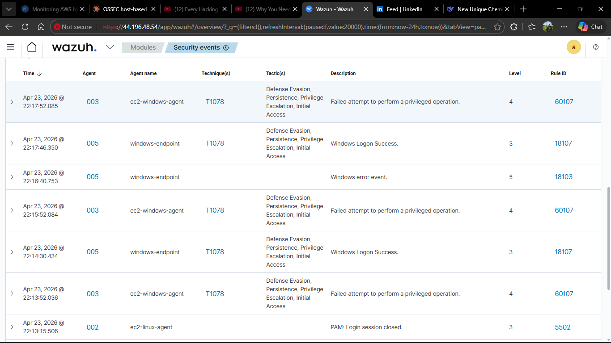

# Hybrid Security Operations — Wazuh SIEM Monitoring On-Premise and AWS Infrastructure


---

## Overview

This is Phase 3 of a three-part security monitoring lab series. The previous two phases covered OSSEC host-based intrusion detection and Wazuh on-premise SIEM deployment. This phase extends the monitoring environment into AWS — building cloud infrastructure, enabling native AWS security services, deploying Wazuh agents on EC2 instances, and connecting on-premise endpoints to a cloud-hosted Wazuh server.

The result is a unified security operations environment where a single Wazuh dashboard shows alerts from both AWS cloud workloads and on-premise Windows machines simultaneously. Real attacks were launched against all targets and detected in real time with automatic MITRE ATT&CK technique classification.

> Phase 1: [OSSEC Host-Based IDS Lab](https://github.com/Emmanuel-cpp/Host-Based-Intrusion-Detection-System-HIDS-Lab-OSSEC.git)
> Phase 2: [Wazuh On-Premise SIEM Lab](https://github.com/Emmanuel-cpp/Wazuh-Enterprise-Security-Lab.git)

---

## Problem Statement

Most security monitoring projects stop at the on-premise boundary. The reality of modern infrastructure is that workloads live in the cloud, on-premise environments still exist, and security teams need visibility across both from one place. This project tackles that exact problem — how do you build a single monitoring environment that covers AWS cloud infrastructure and on-premise endpoints simultaneously, and how do you integrate AWS native security services into that monitoring pipeline?

The secondary challenge was doing this under real-world constraints — a local ISP using Carrier Grade NAT which makes traditional port forwarding impossible, limited compute budget on AWS, and the version compatibility issues that come with mixing different components of a security stack.

---

## Architecture

```
┌──────────────────────────────────────────────────────────────────────────┐
│                        AWS CLOUD — us-east-1                              │
│                    VPC: wazuh-soc-vpc (10.0.0.0/16)                      │
│                                                                            │
│   Wazuh Server (t2.large)    EC2 Linux Agent    EC2 Windows Agent        │
│   Ubuntu 22.04               Ubuntu 22.04        Windows Server 2022     │
│   44.196.48.54               10.0.7.95           10.0.4.196              │
│                                                                            │
│   CloudTrail → S3 Bucket → Wazuh AWS Module → Wazuh Server               │
│   GuardDuty  → Threat Detection                                           │
│   VPC Flow Logs → CloudWatch                                              │
└──────────────────────────────────────────────────────────────────────────┘
                            |
                  agents report over internet
                            |
              On-Premise Windows Host (windows-endpoint)
```

The Wazuh server has a single public IP in AWS. On-premise agents connect outbound to this IP over the internet. No inbound connections to the home network are required — a deliberate architectural decision explained in the challenges section below.

---

## What Was Built

### AWS Infrastructure

A dedicated VPC was created for this lab with public and private subnets, an Internet Gateway, and security groups configured with least-privilege rules for each instance. Three EC2 instances were deployed — a Wazuh server on a t2.large for sufficient memory, a Linux agent on t2.micro, and a Windows Server 2022 agent on t2.medium. A fourth attacker instance was deployed inside the same VPC to simulate cloud-internal attacks.

### AWS Native Security Services

Three AWS security services were enabled and configured:

**CloudTrail** captures every API call made across the AWS account and writes logs to an S3 bucket. This creates an audit trail for everything that happens at the AWS control plane level — who created a resource, who modified a security group, who accessed an S3 bucket, and when.

**GuardDuty** runs continuously in the background using machine learning to analyze CloudTrail logs, VPC Flow Logs, and DNS queries for suspicious patterns. It generates findings when it detects anomalies such as unusual API calls, known malicious IP communication, or reconnaissance activity.

**VPC Flow Logs** capture metadata for every network connection entering and leaving the VPC — source IP, destination IP, port, protocol, and whether the connection was accepted or rejected by the security group.

### Wazuh Cloud Deployment

Wazuh 4.7.5 was deployed on an EC2 instance using the official all-in-one installer. The deployment covers all three Wazuh components — Manager for log analysis and rule processing, Indexer for alert storage, and Dashboard for visualization.

The Wazuh AWS module was configured in ossec.conf to pull CloudTrail logs from S3 every five minutes and analyze them against Wazuh's built-in AWS ruleset. This creates a direct pipeline from AWS API activity to Wazuh alerts.

### Agent Deployment

Wazuh agents were installed on both EC2 instances and the on-premise Windows machine. All agents connect to the cloud Wazuh server at 44.196.48.54. The on-premise agent connects outbound over the internet — no special network configuration required on the home network side.

---

## Lab Setup


> Three agents active on the cloud Wazuh dashboard — EC2 Linux, EC2 Windows Server 2022, and on-premise Windows 11. All reporting to the same server deployed in AWS us-east-1.

---

## Attack Results

### SSH Brute Force — EC2 Linux Agent

An attacker EC2 instance inside the same VPC launched a full SSH brute force against the Linux agent using Hydra and the rockyou wordlist against the private IP.


Wazuh detected the pattern of repeated authentication failures and escalated from individual Level 5 failures to a Level 10 brute force alert. Rule 40111 fired — Multiple authentication failures — with MITRE T1110 Credential Access mapped automatically. Rule 2502 also fired at Level 10 — user missed the password more than one time. The attack was happening inside the AWS VPC between two EC2 instances and Wazuh caught it entirely through host-level log analysis on the target machine.

---

### Privilege Escalation — On-Premise Windows Endpoint

A backdoor user was created on the on-premise Windows machine and added to the local administrators group to simulate post-compromise privilege escalation.


Rule 18151 fired at Level 10 — Multiple failed attempts to perform a privileged operation by the same user — mapped to MITRE T1110 Credential Access. Rule 18113 at Level 8 fired when the Windows audit policies were modified. All of this was detected on the cloud Wazuh server despite the on-premise machine being behind a carrier-grade NAT with no inbound port forwarding.

---

### Privilege Escalation — EC2 Windows Agent

The same attack was replicated on the EC2 Windows Server. A backdoor user named hacker was created and added to the Administrators group.


This generated the highest severity alert in the entire lab — Rule 60154 at Level 12 Critical — Administrators group changed. MITRE T1484 was mapped across Defense Evasion and Privilege Escalation tactics automatically. Rule 60109 at Level 8 fired for user account creation mapped to T1098 Persistence. The alert chain tells a clear story of initial compromise followed by privilege escalation — exactly what Wazuh is built to surface.

---

### CloudTrail Integration

The Wazuh AWS module successfully connected to the CloudTrail S3 bucket and began pulling logs after the credentials were embedded directly in ossec.conf rather than using an AWS profile.


---

## Alert Summary

| Rule | Level | Description | Agent | MITRE Technique |
|---|---|---|---|---|
| 40111 | 10 | Multiple authentication failures | ec2-linux-agent | T1110 Credential Access |
| 2502 | 10 | User missed password multiple times | ec2-linux-agent | T1110 Credential Access |
| 18151 | 10 | Multiple failed privileged operations | windows-endpoint | T1110 Credential Access |
| 60154 | 12 | Administrators group changed | ec2-windows-agent | T1484 Defense Evasion |
| 60109 | 8 | User account created | ec2-windows-agent | T1098 Persistence |
| 18113 | 8 | Windows Audit Policy changed | windows-endpoint | — |
| 5758 | 8 | Maximum authentication attempts exceeded | ec2-linux-agent | T1110 Credential Access |

Highest alert level reached: Level 12 Critical on EC2 Windows — Administrators group changed.

---

## Challenges and How They Were Resolved

### CGNAT — Port Forwarding Impossible

The most significant architectural challenge in this project was discovering that the local ISP uses Carrier Grade NAT. The router's WAN IP was 110.113.7.164 — a private address assigned by ZedMobile — while the public-facing IP was a shared carrier address in the 102.208.221.x range that changes frequently and cannot be port-forwarded through.

This made the original plan — running the Wazuh server on-premise and connecting EC2 agents to it — completely unworkable. The solution was to move the Wazuh server to AWS EC2 instead. This actually produced a better architecture because on-premise agents connect outbound to the cloud server rather than requiring inbound access through a NAT they do not control. This pattern — cloud-hosted SIEM receiving agents from anywhere — is how many enterprise environments are structured.

### EBS Volume Size

The Wazuh dashboard installation failed on first attempt because the EC2 instance was launched with the default 8GB root volume. The dashboard package requires approximately 975MB of additional disk space and the install failed mid-way through with a disk full error. The EBS volume was resized to 50GB through the AWS console and the root partition was expanded using growpart and resize2fs before the installer was run again successfully.

### Wazuh Agent Version Mismatch

The EC2 Linux instance had a pre-existing Wazuh agent installation at version 4.14.4 from a previous attempt. The Wazuh manager installed was version 4.7.5. Wazuh requires agents to run the same or lower version than the manager — the newer agent was rejected with the error "Agent version must be lower or equal to manager version." The agent was downgraded to 4.7.5 to match the server.

### AWS Credentials for CloudTrail Integration

The initial CloudTrail configuration used an AWS profile reference in ossec.conf. Wazuh runs as the wazuh system user and could not locate the credential profile regardless of where the credentials file was placed. The solution was to embed the access key and secret key directly in the ossec.conf configuration block rather than using a named profile. This resolved the "config profile could not be found" error immediately.

### Password Authentication on EC2 Linux

AWS EC2 Ubuntu instances disable password authentication by default through an override file at /etc/ssh/sshd_config.d/60-cloudimg-settings.conf. The main sshd_config file was modified correctly but the override file took precedence and continued blocking password-based SSH. Once the override file was updated directly and the SSH daemon restarted, Hydra was able to attempt logins and generate the authentication failure alerts needed for the demo.

---

## AWS Native Security Tools — Where They Fit

This project integrates Wazuh with three AWS native security services. Understanding how they complement each other is relevant to any cloud security role.

| Service | What it sees | Limitation without Wazuh |
|---|---|---|
| CloudTrail | Every AWS API call at account level | Does not see inside EC2 instances |
| GuardDuty | Behavioral anomalies using ML on CloudTrail and VPC data | AWS-only, no on-premise visibility |
| VPC Flow Logs | Network connections in and out of the VPC | Network metadata only, no host context |

Wazuh fills the gaps that AWS native tools cannot cover — visibility inside EC2 instances at the host level, correlation across cloud and on-premise environments, MITRE ATT&CK mapping, and a unified dashboard for everything. In production environments both layers are run together. AWS native tools handle the cloud control plane and Wazuh handles the host and hybrid layer.

---

## What Follows

The natural next step is integrating AWS Security Hub to aggregate GuardDuty findings directly into the Wazuh alert pipeline. Adding Amazon Inspector would enable automated vulnerability scanning on the EC2 instances. Extending the same Wazuh server to monitor Azure or GCP infrastructure would demonstrate multi-cloud security monitoring — a common requirement in enterprise environments where workloads span multiple providers.

---

## Project Series

This lab is the third in a progressive series:

- Phase 1 — OSSEC: Understanding host-based intrusion detection from the raw engine level
- Phase 2 — Wazuh On-Premise: Building a full SIEM with multiple endpoints including independent external machines
- Phase 3 — This project: Extending the monitoring environment into AWS with cloud infrastructure and native security service integration

---

## References

- [Wazuh AWS Cloud Security Documentation](https://documentation.wazuh.com/current/cloud-security/amazon/index.html)
- [Wazuh Monitoring AWS Instances](https://documentation.wazuh.com/current/cloud-security/amazon/instances.html)
- [Wazuh AWS S3 Module](https://documentation.wazuh.com/current/cloud-security/amazon/services/index.html)
- [MITRE ATT&CK Framework](https://attack.mitre.org)

---

## Author

**Emmanuel Siamoonga**
Cloud Infrastructure | Network and Cloud Security | The Copperbelt University, Kitwe, Zambia

[](https://www.linkedin.com/in/emmanuel-siamoonga-98b30929b/)
[](https://github.com/Emmanuel-cpp)

> "Security is not a product, but a process." — Bruce Schneier
